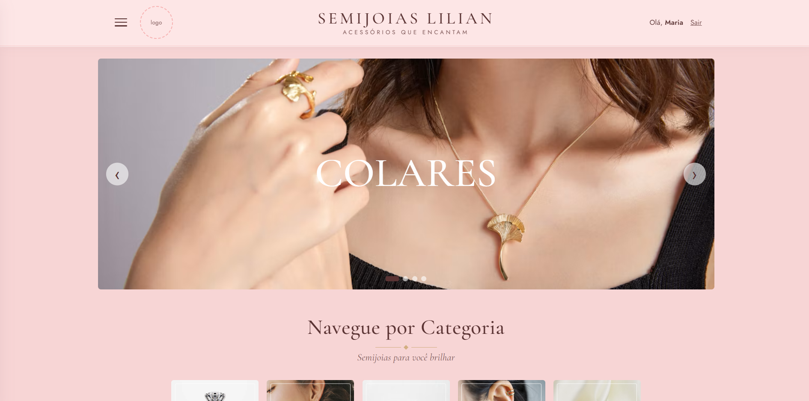
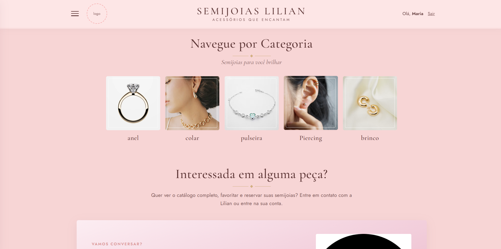
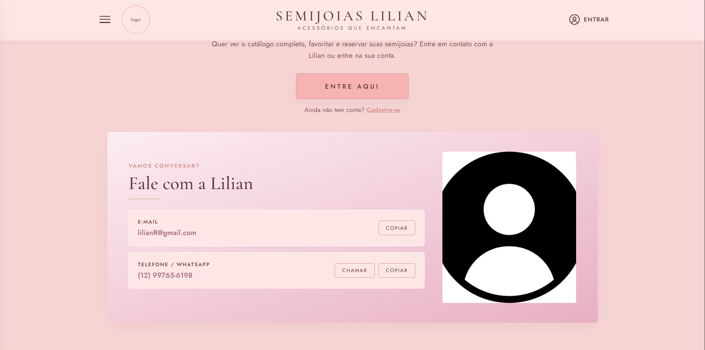
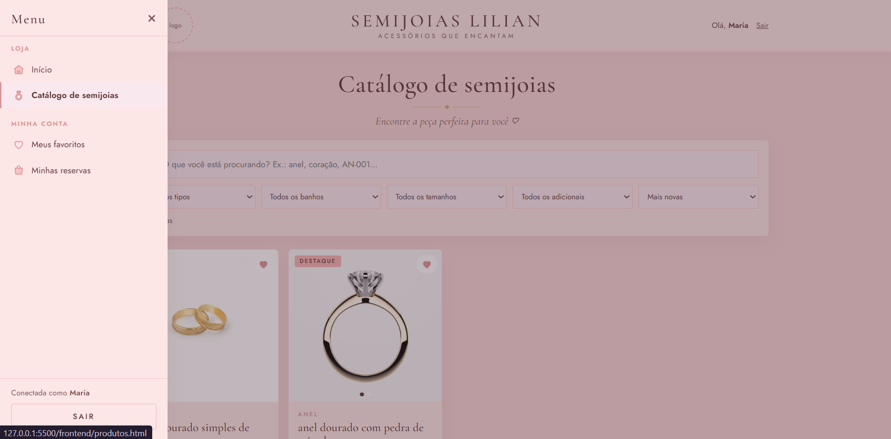
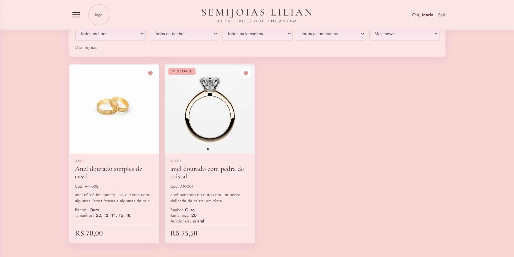
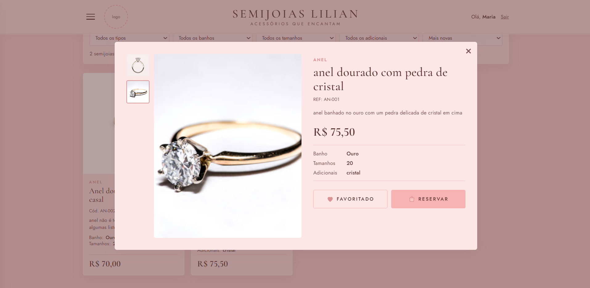
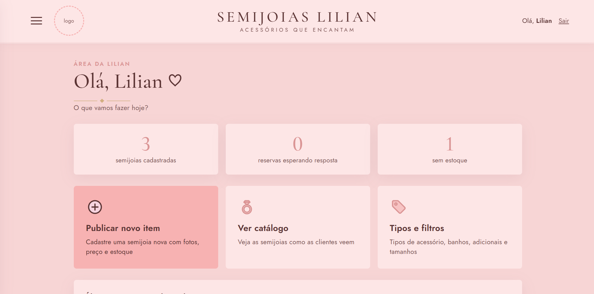
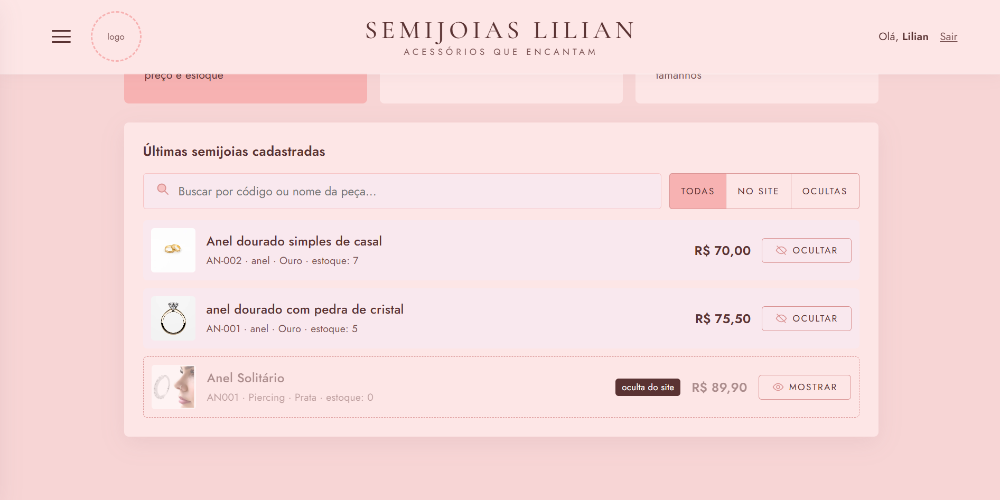

# 💎 Loja-SemiJoias

> **EM ANDAMENTO**
> - **03/10:** backend concluído
> - **05/10:** frontend em desenvolvimento, já com um rascunho sólido (veja as imagens abaixo)

Site para a loja de semijoias da minha tia **Lilian**. Ela não fabrica as peças, revende semijoias de vários fornecedores, e o site funciona como um **catálogo online com reservas**: as clientes navegam, filtram, favoritam e reservam peças, e a Lilian gerencia tudo por um painel próprio.

---

##  Funcionalidades

###  Administradora
- Cadastra semijoias com fotos, preço, código, descrição e estoque
- Cria os próprios filtros: **tipo** (anel, pulseira, colar...), **banho** (ouro, prata, ouro velho...), **adicionais** (pedras brancas, pedras rosas, perolado...) e **tamanhos** (16, 18...)
- Controla o **estoque** e de qual **empresa/fornecedor** vem cada peça (informação que só ela vê, junto com o preço de custo)
- Pode **ocultar** uma peça do site sem apagá-la
- Vê **todas as reservas**: qual cliente reservou qual peça, e muda o status (pendente, aprovada, entregue)
- Edita as informações do site: logo, contatos e fotos do carrossel da página inicial

### Cliente
- Cria conta e faz login
- Vê o catálogo e **filtra** por tipo de acessório, banho, cor das pedras e tamanho, ou busca pelo nome/código
- **Favorita** as peças que gostar (lista particular, a administradora não tem acesso)
- **Reserva** uma peça: a reserva aparece para a administradora, e as duas podem trocar **mensagens** dentro dela
- Pode cancelar a reserva informando o motivo

### 👀 Visitante
- Navega pelo catálogo e vê os detalhes das peças, mas precisa entrar para favoritar ou reservar

---

## 🛠️ Tecnologias

| Parte | Tecnologias |
|---|---|
| **Backend** | JavaScript, Node.js, Express 5, arquitetura **MVC** |
| **Banco de dados** | MySQL 8 (driver `mysql2`) |
| **Autenticação** | JWT (login com token) e senhas criptografadas com `bcrypt` |
| **Upload de fotos** | Multer |
| **Frontend** | HTML, CSS e JavaScript puro (sem framework), consumindo a API com `fetch` |
| **Testes da API** | Insomnia (coleção incluída no projeto) |

---

## 📁 Estrutura

```
backend/
  server.js                 liga o servidor
  database/                 script do banco (semijoias_db.sql) e atualizações
  insomnia/                 coleção e guia para testar a API
  scripts/criar-admin.js    cria a primeira administradora
  src/
    config/                 conexão com o MySQL
    routes/                 qual URL chama qual controller
    middlewares/            login (token), permissões, upload e erros
    controllers/            recebe a requisição, valida e responde
    models/                 único lugar que conversa com o banco (SQL)

frontend/
  index.html                página inicial (carrossel, categorias, contato)
  produtos.html             catálogo com filtros
  favoritos.html            favoritos da cliente
  reservas.html             reservas e mensagens
  admin.html, publicar.html, categorias.html, site.html   área da Lilian
  css/  js/                 estilos e scripts de cada página
```


## 📸 Imagens

<!-- Troque os caminhos abaixo pelos das suas imagens no repositório -->

| Página inicial 1 | Página inicial 2 | Página inicial 3 |
|---|---|---|
|  |  |  |

| Menu| Catálogo | Detalhes da peça |
|---|---|---|
|  |  |  |

| Painel da Lilian 1 | Painel da Lilian 2 |
|---|---|
|  |  |

| Reservas (clientes) 1 | Reservas (clientes) 2 |
|---|---|
|  |  |
---

## Próximos passos
- conversar com a cliente sobre seu site
- Finalizar e refinar o frontend
- Ajustes de layout para celular
- Colocar o site no ar
